# Deconvolution of Spatial Transcriptomics using scRNA-seq

<center>
Wenxin Jiang

Oct. 18, 2024
</center>

---

TODO list:

- [ ] Add reference

---

## Structure of the Presentation

1. Introduction to the [spatial transcriptomics](#method-of-the-year-spatially-resolved-transcriptomics) and [scRNA-seq](#single-cell-rna-sequencing-scrna-seq)
2. [Deconvolution methods](#deconvolution-methods): [RCTD](#rctd-robust-cell-type-deconvolution) and [Cell2Location](#cell2location)
3. Simulation study and real data application

---

## Method of the Year: Spatially Resolved Transcriptomics

<div style="align-items: center;">
    <div style=" text-align: center;">
        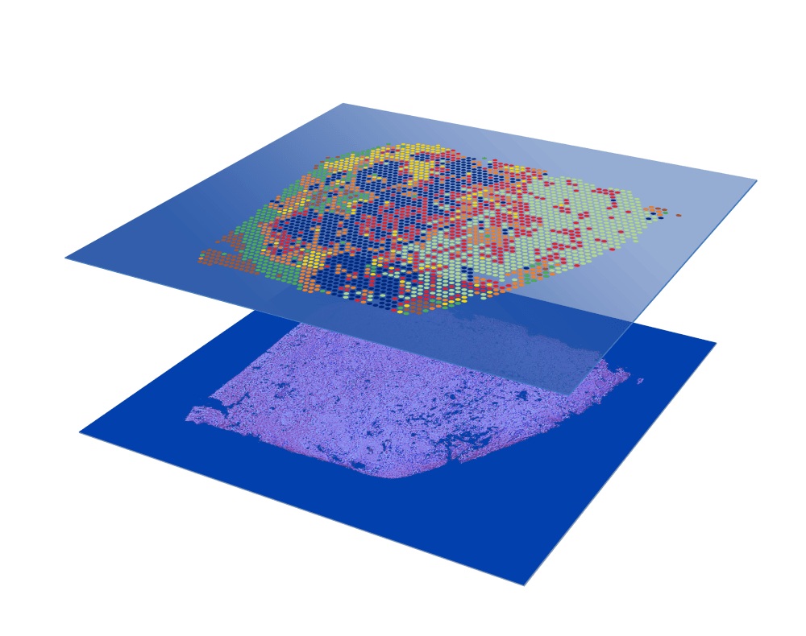
        <p><small>  </small></p>
    </div>
</div>

---

### Spatial Transcriptomics Maps Gene Expression in Tissue

<div style="align-items: center;">
    <div>
        
        <p style="text-align: center;"><small>Spatial transcriptomics combines the spatial information of tissue sections with the gene expression data from RNA sequencing.</small></p>
    </div>
</div>

<!-- Using spatial barcodes, RNAs can be traced back to
a specific location in the sample -->

---

<!-- ### Discovering Single-Cell Resolution in Space

<div style="align-items: center;">
    <div>
        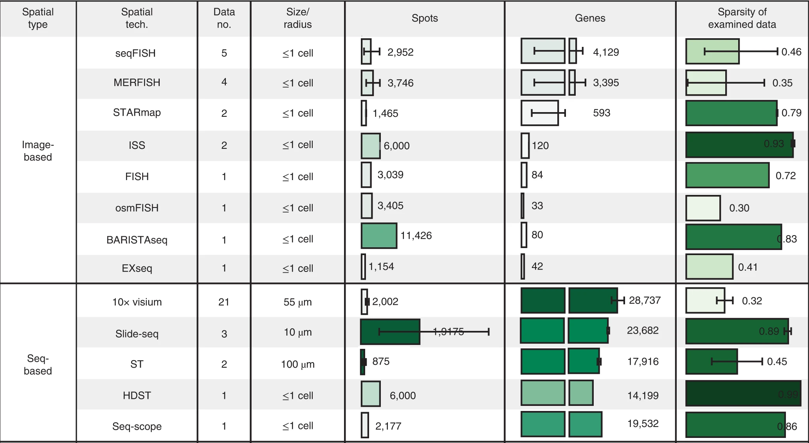
        <p style="text-align: center;"><small>Comparison of image-based and sequencing-based spatial transcriptomics.</small></p>
    </div>
</div>

--- -->

### Example: Mouse Hippocampus in 10x Visium

<div style="display: flex; align-items: center;">
    <div style="flex: 1; text-align: center;">
        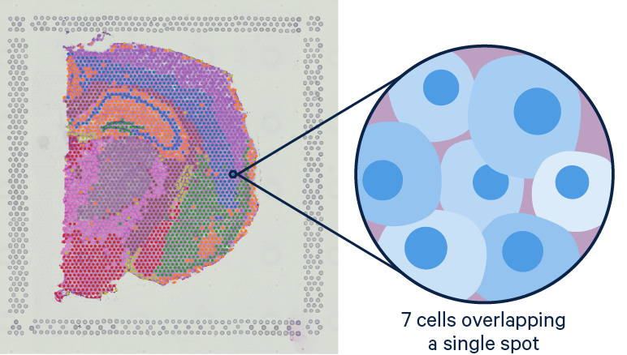
        <p><small>Example of spatial transcriptomics</small></p>
    </div>
    <div style="flex: 1; text-align: center; margin-left: -40px;">
        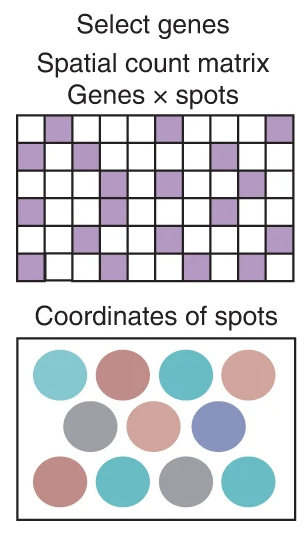
        <p><small>Structure of the spatial transcriptomics data</small></p>
    </div>
</div>

The size of barcoded spots in Visium does not allow us to study gene expression in individual cells. With mixture cell types in spots, we can not directly map the cell types to the spots.

---

### Deconvolution: Mapping scRNA-seq to Spatial Transcriptomics

<div style="align-items: center;">
    <div>
        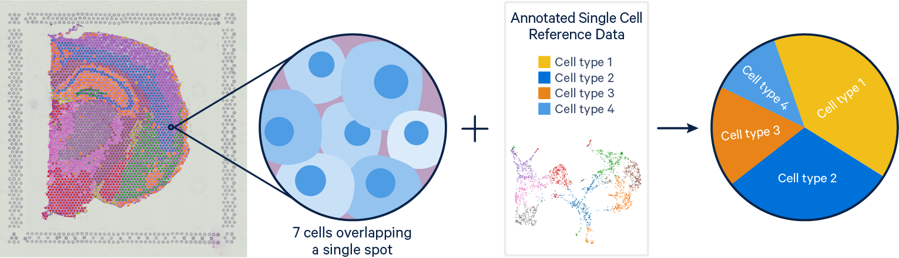
        <p style="text-align: center;"><small>Illustration of deconvolution process</small></p>
    </div>
</div>

With the reference scRNA-seq data, we can estimate the cell type composition in each spot of the spatial transcriptomics data.

---

## Single-Cell RNA Sequencing (scRNA-seq)

<div style="align-items: center;">
    <div>
        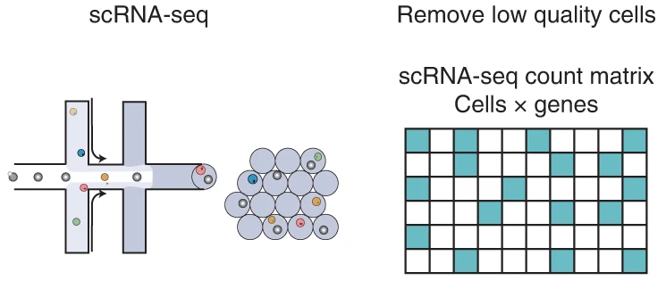
        <p style="text-align: center;"><small>Process of scRNA-seq and its data structure</small></p>
    </div>
</div>

---

### Compare scRNA-seq with Spatial Transcriptomics

- **Spatial transcriptomics**:
    - Spatial information
    - Typically low cellular resolution
    - Sequence depth is limited
- **scRNA-seq**:
    - Single-cell resolution
    - High sequence depth

---

## Summary on scRNA-seq and Spatial Transcriptomics

<div style="align-items: center;">
    <div>
        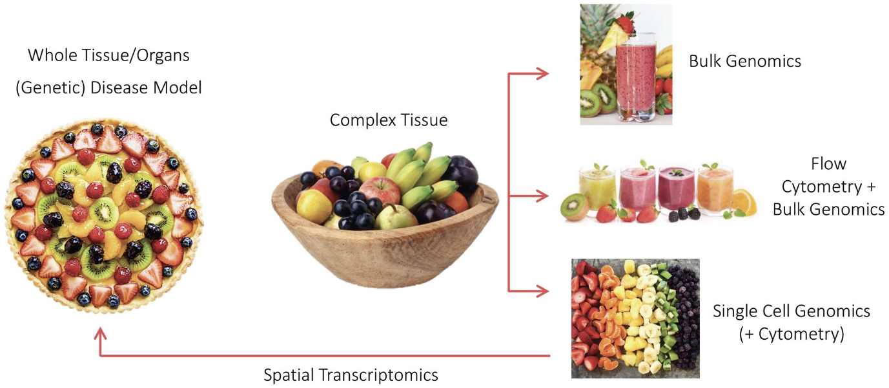
        <p style="text-align: center;"><small>
        Understanding the Complexity of Tissue with bulk RNA-seq, scRNA-seq, and spatial transcriptomics</small></p>
        </small></p>
    </div>
</div>
<!-- https://twitter.com/LGMartelotto/status/1186745128615985152 -->

---

## Insights from Deconvolution Results

<div style="align-items: center;">
    <div>
        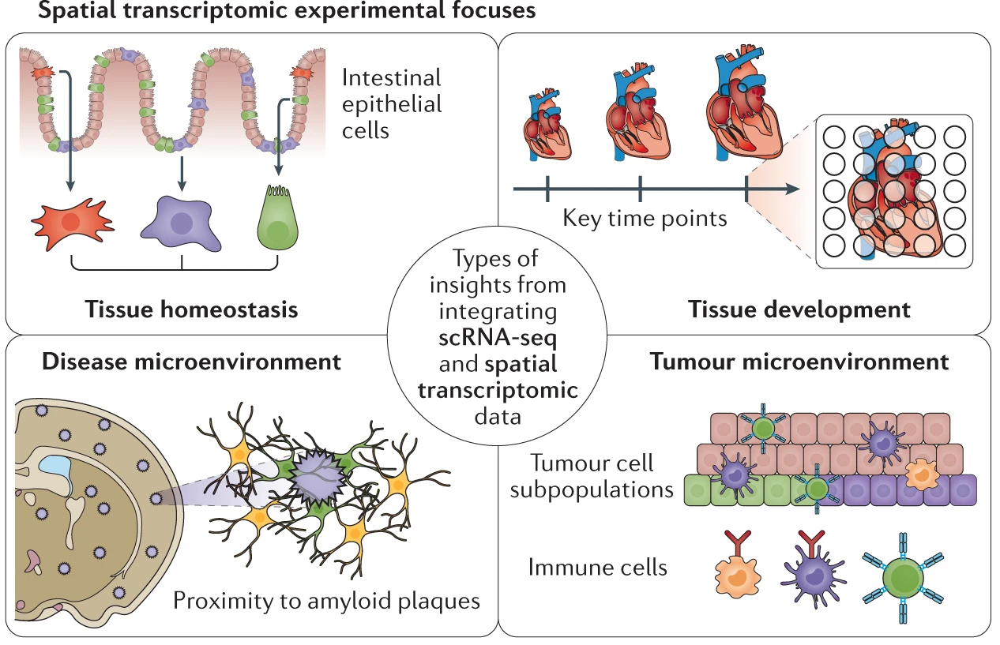
        <p style="text-align: center;"><small>  </small></p>
    </div>
</div>

Integrating scRNA-seq and spatial transcriptomics data increase our understanding of the roles of specific cell subpopulations and their interactions in development, homeostasis and disease.

<!-- ‘Tissue homeostasis’ refers to elucidating spatial division of discrete cellular subtypes in a healthy tissue at a singular time point, for example, in the intestinal epithelium. ‘Tissue development’ refers to the study of how the spatial transcriptome changes in tissue at key stages in the development of a tissue. ‘Disease microenvironment’ refers to elucidating the spatial transcriptome in diseased and injured tissue niches with an eye towards proximity to relevant biological features, for example, proximity to amyloid plaques in brain tissue of patients with Alzheimer disease. ‘Tumour microenvironment’ refers to the study of spatial architecture of tumours and their interface with other cell subtypes in their environment. -->

---

## Deconvolution Methods

<div style="align-items: center;">
    <div>
        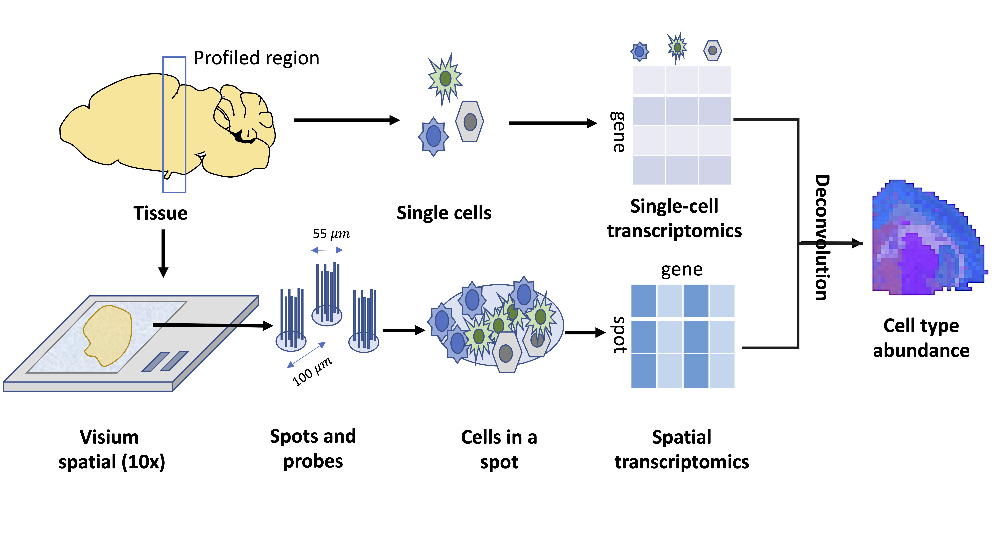
        <p style="text-align: center;"><small> Estimated cell abundances (color intensity) of selected regional astrocyte subtypes.</small></p>
    </div>
</div>

---

## RCTD: Robust Cell Type Deconvolution

<div style="align-items: center;">
    <div>
        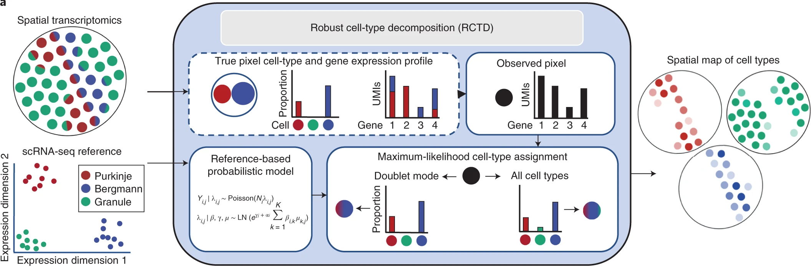
        <p style="text-align: center;"><small>Illustration of the RCTD method</small></p>
    </div>
</div>

---

### RCTD Notation

Indexing:

- $s$: index of the spot in spatial transcriptomics dataset
- $g$: index of the gene
- $f$: index of the cell type

---

### RCTD Notation

Dataset:

- $d_{sg}$: observed gene expression count in spot $s$ for gene $g$
- $g_{fg}$: mean gene expression for gene $g$ in cell type $f$
- $w_{sf}$: proportion of cell type $f$ in spot $s$. $\sum_f w_{sf} = 1$ and $w_{sf} \geq 0$
- $\lambda_{sg}$: parameter of the Poisson distribution for gene $g$ in spot $s$.
- $y_s$: total transcript count in spot $s$
- $\alpha_{s}$: fixed pixel-specific effect for spot $s$
- $m_{g}$: gene-specific platform random effect for gene $g$
- $\epsilon_{sg}$: residual error term for gene $g$ in spot $s$

---

### RCTD Model

$$\begin{equation}\begin{aligned}
d_{sg}|\lambda_{sg} &\sim \text{Poisson}(y_s \lambda_{sg}) \\
\log(\lambda_{sg}) &= \alpha_{s} + \log(\sum_f w_{sf} g_{fg}) + m_{g} + \epsilon_{sg} \\
\end{aligned}\end{equation}
$$

Goal: estimate $w_{sf}$ with $g_{fg}$ estimated from scRNA-seq data.

Prior:

- $m_{g} \sim \text{Normal}(0, \sigma^2_{m})$
- $\epsilon_{sg} \sim \text{Normal}(0, \sigma^2_{\epsilon})$. Note: using a Cauchy-Gaussian mixture model for including heavy-tailed noise.

---

### RCTD Model fitting

1. Estimate mean gene expression $g_{fg}$ from scRNA-seq data, denoted as $\hat{g}_{fg}$.
2. Gene filtering: filter out uninformative genes based on $\hat{g}_{fg}$. Reduce to about 3k genes.

---

### RCTD Model fitting

3. Platform effect normalization: estimate $m_{g}$ for gene $g$ by summarizing the spatial transcriptomics as a single pseudo-bulk measurement $S_g \equiv \sum_s d_{sg} \sim \text{Poisson}(\bar{d}_{g})$ with
$$
\begin{aligned}
\log(\mathbb{E}[\bar{d}_{g}]|\lambda_{.g}) &= \log\left(\frac{1}{S} \sum_s y_s \lambda_{sg}\right) \\
&= m_{g} + \log(\bar{y}\sum_f B_{fg} g_{fg})\\
&\approx m_{g} + \log(\bar{y}\sum_f w_{f} g_{fg}) + \log(w_0)
\end{aligned}
$$

where $B_{fg} = \frac{1}{S} \sum_s \frac{y_s}{\bar{y}} w_{sf} \exp(\alpha_{s}+\epsilon_{sg})$ and $w_{f} = \frac{1}{S} \sum_s \frac{y_s}{\bar{y}} w_{sf}\alpha_{s}$. Obtain the MLE of unknown parameters ($w_{f}, w_{0}, \sigma^2_{m}$) and solve for $m_{g}$. Denote the predicted platform effect as $\hat{m}_{g}$.

---

### RCTD Model fitting

4. **RCTD**: estimate $w_{sf},\alpha_{s}$ and $\sigma^2_{\epsilon}$ by MLE. Assume estimated $\hat{g}_{fg}$ and $\hat{m}_{g}$ are fixed.
5. Expected cell-type-specific gene expression: $\mathbb{E}[d_{sf}|w, d_{sg}] = \frac{d_{sg}w_{sf}\hat{g}_{fg}}{\sum_{f'} w_{sf'}\hat{g}_{f'g}}$.

---

### RCTD Model selection

**RCTD** has three modes:

- **Doublet mode** assigns 1-2 cell types per spot and is recommended for technologies with high spatial resolution such as **Slide-seq** and **MERFISH**;
- **Full mode** assigns any number of cell types per spot and is recommended for technologies with poor spatial resolution such as **100-micron resolution Visium**
- **Multi mode** is an extension of doublet mode that can discover more than two cell types (up to a prespecified amount) per spot as an alternative option to full mode.

<small>Note: If in doublet mode, fits at most two cell types per pixel. It classifies each pixel as 'singlet' or 'doublet' and searches for the cell types on the pixel. If in full mode, can fit any number of cell types on each pixel. In multi mode, cell types are added using a <b>greedy algorithm</b>, up to a fixed number.</small>

---

#### Cell type identification by model selection

Denote $\mathcal{L}(f)$ as the likelihood of the model with only $f$ th cell type and $\mathcal{L}(f, f')$ as the likelihood of the model only with $f$th and $f'$th cell types. For each spot $s$,

$$
\hat{f} = \arg\max_f \mathcal{L}(f) \quad \text{and} \quad \hat{f'} = \arg\max_{f'\neq \hat{f}} \mathcal{L}(\hat{f}, f')
$$

Because we expect many pixels to be single cell types, we can a **penalized approach similar to AIC** to decide between the two models. We select the model maximizing

$$\text{AIC}(\mathcal{M}) \equiv \mathcal{L}(\mathcal{M}) - V_p(\mathcal{M})$$

where $p$ represents the number of parameters (cell types) and $V$ represents the penalty weight. Select $V=25$ based on simulation studies.

---

#### Confident and unconfident spots

Condition: Existence of another pair of cell types $(f, f')$ (f can be equal to f') such that $|\mathcal{L}(\hat{f}, \hat{f'}) - \mathcal{L}(f, f')| < \delta$.

If the condition does hold, the spot is **unconfident**, otherwise, it is **confident**. The threshold $\delta$ is set to 10 based on simulation studies.

---

### Sequential quadratic programming for MLE

Note: Convert nonlinear problems into a series of quadratic programming problems.

#### Convert to Quadratic Programming (QP)

The parameter $\alpha_s$ effectively allows us to re-scale $w_s$, so we define $w_{f, s}=w_{f, s} e^{\alpha_s}$, which **will not be constrained to sum to 1**. Next, define:

$$
\bar{\lambda}_{s, g}\left(w_s\right)=y_s \sum_{f=1}^F w_{f, s} g_{f, g} e^{\hat{m}_g}=y_s \sum_{f=1}^F w_{f, s} \bar{g}_{f, g}
$$

We will refer to this as the predicted mean of gene $g$ in pixel $s$.

---

#### Convert to Quadratic Programming (QP)

The final model is a Poisson log-normal mixture model:

$$
d_{s, g} \mid \bar{\lambda}_{s, g} \sim \operatorname{Poisson}\left(e^{\varepsilon_{s, g}} \bar{\lambda}_{s, g}\left(w_s\right)\right), \quad \varepsilon_{s, g} \sim \operatorname{Normal}\left(0, \sigma_{\varepsilon}^2\right)
$$

We estimate $w_s^* \geq 0$ as the solution that maximizes the $\log$-likelihood $\mathcal{L}\left(w_s\right)$ :

$$
\max \mathcal{L}\left(w_s\right)=\sum_{g=1}^G \log P\left(d_{s, g} \mid \bar{\lambda}_{s, g}\left(w_s\right)\right) \quad \text { subject to: } w \geq 0
$$

---

#### Convert to Quadratic Programming (QP)

From now on, we consider a fixed spot $s$ and suppress the notation of $s$. We will estimate $w^* \geq 0$ as that which maximizes the $\log$-likelihood $\mathcal{L}(w)$ :

$$
\max _w \mathcal{L}(w)=\sum_{g=1}^G \log P\left(d_g \mid \lambda_g(w)\right)=\sum_{g=1}^G \log Q_{d_g}\left(\lambda_g(w)\right)
$$

Our log likelihood is non-convex. To optimize it, we will apply Sequential Quadratic Programming, an iterative procedure that will be repeated until convergence. Let $w_0$ be the value of $w$ at a given iteration, and let the gradient of $-\mathcal{L}$ be $b(w)$ and the Hessian of $-\mathcal{L}$ be $A(w)$. Then, we can make the following quadratic Taylor approximation to $\mathcal{L}$:

$$
-\mathcal{L}(w) \approx-\mathcal{L}\left(w_0\right)+b\left(w_0\right)^T\left(w-w_0\right)+\frac{1}{2}\left(w-w_0\right)^T A\left(w_0\right)\left(w-w_0\right)
$$

---
### Advantages of RCTD

#### Platform effect

Defined as the log2 ratio of average gene expression between platforms.
<div style="text-align:center;">
  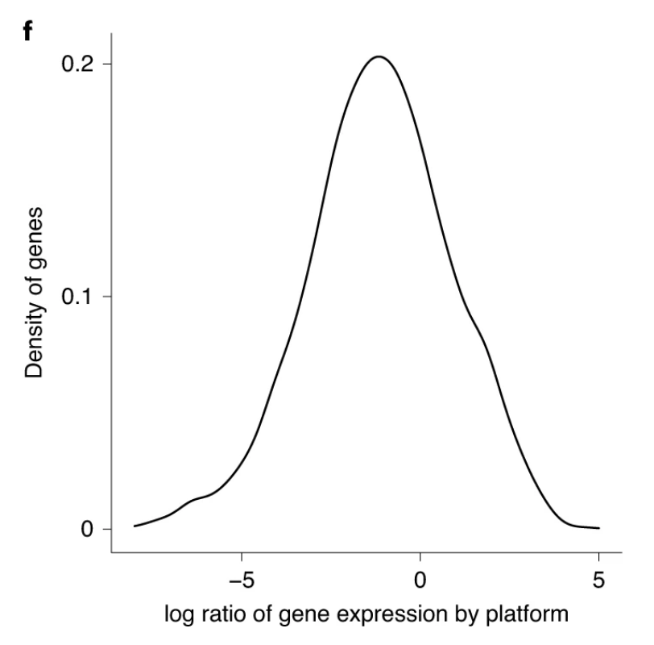
  <p><small>Figure 1f: Density plot across genes of measured platform effects between cerebellum <b>scRNA-seq</b> and <b>snRNA-seq</b> data.</small></p>
</div>

If not accounted for the platform effect, the supervised method would have a high accuracy in training data but a low accuracy in test data ([Fig1-de](https://www.nature.com/articles/s41587-021-00830-w/figures/1)).

In the 3rd step of model fitting, RCTD estimates the platform effect of each gene to transfer cell type information from scRNA-seq to spatial transcriptomics. Fig 2b and 2c illustrate that RCTD recovered the platform effect well.

<small>Note: Because the ground truth of cell types is unknown in spatial transcriptomics, the benchmark of platform effect modeling is based on the sc and snRNA-seq data.</small>

<div style="text-align:center;">
  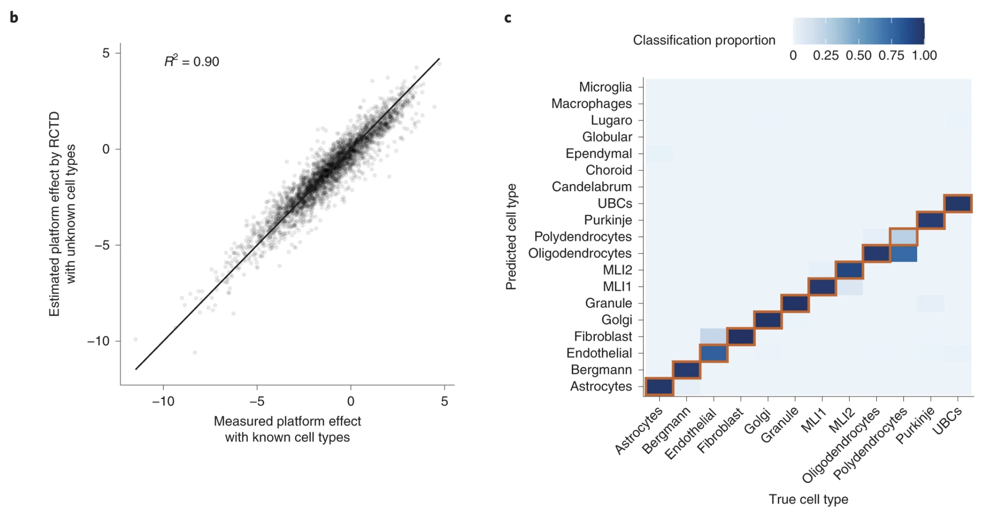
  <p><small><b>Figure 2b</b>, Scatter plot of measured versus predicted platform effect (by RCTD) for each gene between the sc and sn cerebellum datasets. <b>Figure 2c</b>, Confusion matrix for RCTD’s performance on cross-platform (trained on snRNA-seq data and tested on scRNA-seq data).</small></p>
</div>

RCTD achieves consistent results when trained on multiple datasets: On confidently classified pixels, RCTD trained on two different references agreed on 95.7% of cell type predictions (SFig. 16). (Trained on the scRNA-seq compared to snRNA-seq cerebellum dataset and tested on Slide-seq cerebellum data.)

---

### Robustness

- **Varying unique molecular identifier (UMI) counts per pixel:** Additional UMIs per pixel led to an increased confidence rate, and RCTD achieved high classification accuracy on pixels containing ≥100 UMIs (SFig. 10).
- **Multi cell types per pixel:** RCTD was able to accurately predict cell class proportions on pixels containing three or four cell types (SFigs. 12 and 13).
- **Missing cell types in the reference:** When cell types in the simulated spatial data were missing from the reference, RCTD classified pixels as the most transcriptionally similar cell type in the reference, if available (SFig. 10). When no closest cell type was available in the reference, RCTD predicted cell types with reduced confidence rates (SFig. 10) but often misclassified such pixels (SFig. 11).

---

### Detecting spatially variable genes and effect of cellular environment

Previous methods ignore the cell type information when searching for spatially variable genes. However, cell types are not evenly distributed in space and have different expression profiles. This approach may lead to confusing cell type marker genes with spatially variable genes.

In Fig 6a-left, the 20 genes with the highest spatial autocorrelation in the Slide-seq hippocampus data were primarily expressed in only a few cell types, **indicating that their spatial variation is partially driven by cell type composition**. After conditioning on cell type, a majority of these genes exhibited small remaining spatial variation (Fig 6b-left).

<div style="text-align:center;">
  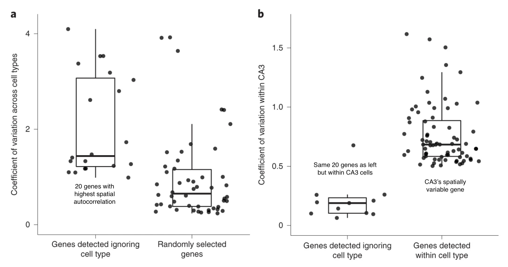
  <p><small><b>Fig 6a</b>, Box plot of the coefficient of variation (CV=std/mean, measure of dispersion) of genes across cell types in the hippocampus scRNA-seq reference. Spatially variable genes were selected for large spatial autocorrelation in the Slide-seq hippocampus data without considering cell type. For reference, 50 randomly selected genes are shown. <b>b</b>, Box plot of the CV in gene expression within CA3 cells identified by RCTD. Left, spatially variable genes selected for large spatial autocorrelation in the hippocampus without considering cell type. Right, using RCTD’s expected cell-type-specific gene expression, genes determined to be spatially variable by applying local regression within the CA3 cell type are shown.</small></p>
</div>

Instead, **RCTD enables the estimation of spatial gene expression patterns within each cell type**. After identifying cell types, we used RCTD to compute the expected cell-type-specific gene expression for each cell type within each pixel. Using this cell-type-specific expected gene expression, we detected genes with large spatial variation within CA3 pyramidal neurons (Fig. 6b-right). For these genes, we recovered smooth patterns of gene expression over space with locally weighted regression (Fig. 6d).

<div style="text-align:center;">
  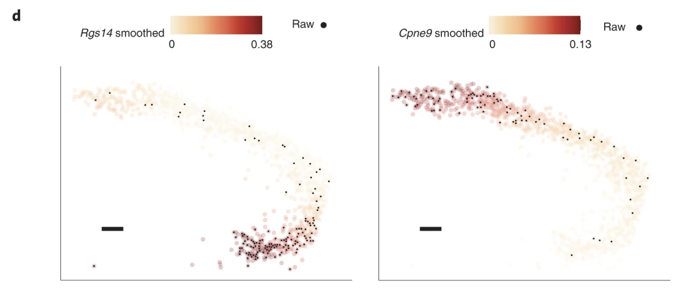
  <p><small><b>Figure 6d</b>: Smoothed spatial expression patterns (counts per 500), recovered by local regression, of two genes detected to have large spatial variation within RCTD’s CA3 cells.</small></p>
</div>

We detected genes whose expression within astrocytes depended on colocalization with another cell type. For instance, we found that Entpd2 was enriched in astrocytes colocalizing with dentate neurons. Moreover, Slc6a11 was differentially expressed in astrocytes around excitatory neurons.(Fig 6f)

<div style="text-align:center;">
  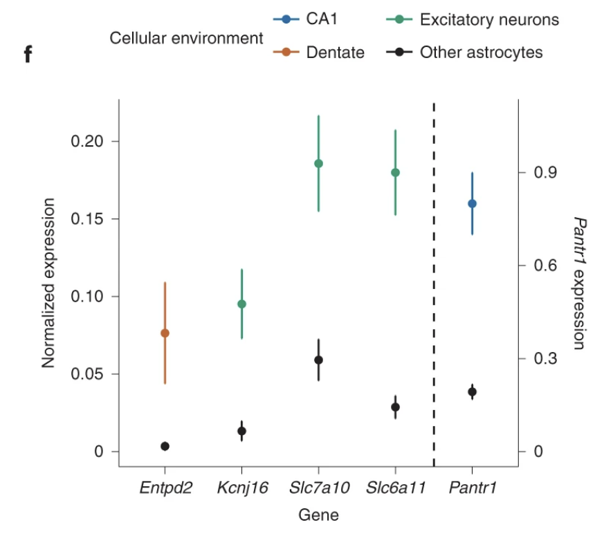
  <p><small><b>Figure 6f</b>: Mean and standard error of RCTD’s expected gene expression (counts per 500) within groups of astrocytes (129 ≤ n ≤ 956 cells per condition) classified by their cellular environment (color). Scale is on the right for Pantr1; scale is on the left for other genes.</small></p>
</div>

---

### Limitations

1. Assume that platform effects are shared across cell types and random noise $\epsilon_{fg}$ are shared across genes.
2. Hard to handle the case when the cell type missing from the reference but exist in the spatial data.

---

## Cell2Location

<div style="align-items: center;">
    <div>
        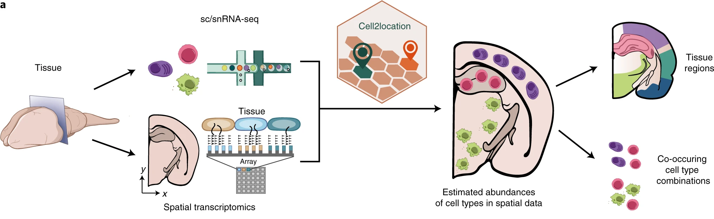
        <p style="text-align: center;"><small>Illustration of the Cell2Location method</small></p>
    </div>
</div>

---

### Cell2Location Notation

**Index**

- $g \in \{1, \ldots, G\}$: Gene
- $s \in \{1, \ldots, S\}$: Spot
- $e \in \{1, \ldots, E\}$: Spatial dataset
- $f \in \{1, \ldots, F\}$: Cell type

**Model parameters**

- $d_{sg}$: Spatial expression of gene $g$ in spot $s$
- $\mu_{sg}$: Unobserved expression level (rate) of gene $g$ in spot $s$
- $\alpha_{eg}$: Gene- and batch-specific over-dispersion parameter
- $m_{g}$: Technology sensitivity parameter for gene $g$
- $w_{sf}$: Regression weight for cell type $f$ in spot $s$
- $g_{fg}$: Reference expression level of gene $g$ in cell type $f$
- $s_{eg}$: Gene-specific additive shift in spatial dataset $e$
- $y_s$: Location-specific scaling factor for spot $s$

**Input**: Matrix of reference expression levels $g_{fg}$ and matrix of spatial expression counts $d_{sg}$.
**Main output**: Regression weights $w_{sf}$ which can be transformed into cell type proportions.

---

### Cell2Location Model

**mRNA counts model**

$$\begin{equation}\begin{aligned}
d_{sg} &\sim \text{NB}(\mu_{sg}, \alpha_{eg}) \\
\mu_{sg} &= \left( m_{g} \sum_{f} w_{sf} g_{fg} + s_{eg} \right) y_s
\end{aligned}\end{equation}$$

**Gene-specific multiplicative scaling factor**

$$\begin{equation}\begin{aligned}
m_g &\sim \text{Gamma}\left(\alpha^m, \alpha^m/\mu^m \right) 
\left\{ \begin{array}{ll}
\alpha^m & = 1/(o^m)^2, \quad o^m \sim \text{Exp}(3) \\
\mu^m &\sim \text{Gamma}(1, 1) \\
\end{array} \right. \\
\end{aligned}\end{equation}$$

**The prior on detection efficiency per location**

$$\begin{equation}\begin{aligned}
y_s &\sim \text{Gamma}\left(\alpha^y, \alpha^y/y_e \right) \quad y_e \sim \text{Gamma}(10, 10/\mu^y)
\end{aligned}\end{equation}$$

**Overdispersion for each gene**

$$\begin{equation}
\alpha_{eg} = 1/o_{eg}^2, \quad o_{eg} \sim \text{Exp}(\beta^o), \quad \beta^o \sim \text{Gamma}(9, 3)
\end{equation}$$

**Additive shift for genes**

$$\begin{equation}\begin{aligned}
s_{eg} &\sim \text{Gamma}\left(\alpha^s_e, \alpha^s_e/\mu^s_e \right)
\left\{ \begin{array}{ll}
\mu^s_e &\sim \text{Gamma}(1, 100) \\
\alpha^s_e &=1/o_e^2, \quad o_e \sim \text{Exp}(\beta^s), \quad \beta^s \sim \text{Gamma}(9, 3)
\end{array} \right.
\end{aligned}\end{equation}$$ 

**Cell abundance prior:**

$$\begin{equation}\begin{aligned}
w_{sf} &\sim \text{Gamma}\left(\sum_r z_{sr} x_{rf} \nu^w, \nu^w\right) \\
z_{sr} &\sim \text{Gamma}\left(B_s/R, 1/(N_s/B_s)\right)
\left\{ \begin{array}{ll}
N_s &\sim \text{Gamma}\left(\hat{N} \nu^n, \nu^n\right) \\
B_s &\sim \text{Gamma}\left(\hat{B}, 1\right) \\
\end{array} \right. \\
x_{rf} &\sim \text{Gamma}\left(K_r/R, K_r\right), \quad K_r \sim \text{Gamma}\left(\hat{A}/\hat{B}, 1\right) \\
\end{aligned}\end{equation}$$

<div style="text-align:center;">
  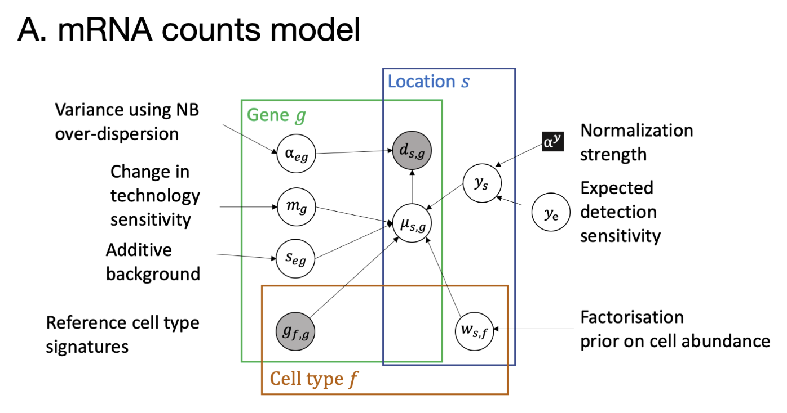
  <p><small></small></p>
  
  <p><small><b>SupFigure 1A</b>: Main part of the model describing spatial mRNA counts. <b>1B</b>: Additional layer of factorisation of cell type abundance prior representing similarity in cell type abundance across locations. Black box highlighting the parameters that require adaptation to a specific data set.
  </small></p>
</div>

---

### Benefits of the Cell2Location model

Joint modelling of multiple spatial experiments/batches provides the several benefits due to normalisation and sharing of information between experiments:

1. Modelling differences in RNA detection sensitivity across experiments: $y_e$ and $y_s$.
2. Increasing accuracy by improving the ability of the model to distinguish low sensitivity $m_g$ from zero cell abundance $w_{rf}$.
3. Increasing sensitivity by sharing factorisation prior on cell abundance $w_{rf}$, namely which cell types tend to co-locate across experiments represented by $x_{rf}$.

---

### Model fitting

#### Construction of reference cell type signatures

By default, the cell2location employs a **negative binomial regression** to estimate reference cell type signatures which allows robust combination of data from multiple sources.

Alternatively, a **hand-coded method** that estimates the average expression of each gene in each cell type can be used.

#### Determining the hyperparameters

1. **Expected cell abundance $\hat{N}$ per location**: A tissue-level global estimate, which can be derived from histology images (H\&E or DAPI), paired to the spatial expression data $d_{s, g}$, or when not available coming from the same tissue type.
2. **Hyperparameter $\alpha^y$ for regularising within-experiment variation in RNA detection sensitivity**: By default, we assume that the data does not have strong within-experiment variability in RNA detection sensitivity across locations $\left(\alpha^y=200\right)$, which results in values of $y_s$ close to the mean sensitivity for each experiment $y_e$. However, when strong gradients in mRNA detection sensitivity are observed, a common issue in human adult 10X Visium data, we recommend less strict regularisation $\left(\alpha^y=20\right)$ to allow normalisation of such effect and improved sensitivity.
3. **Expected detection sensitivity $\mu^y$:** A single global estimate which is derived from average total RNA counts observed in input spatial data $d_{s, g}$, reference cell type signatures $g_{f, g}$, and the value of $\hat{N}$ as follows:
$$
\mu^y=\frac{\frac{\sum_s \sum_g d_{s, g} / S}{\hat{N}}}{\sum_f \sum_g g_{f, g} / F}
$$
where $S$ is the total number of locations and $F$ is the total number of cell types.

---

#### Inference Cell2Location Model

Variational Bayesian Inference is used to approximate the posterior, building on the Automatic Differentiation Variational Inference (ADVI) framework implemented in pyro. An alternative implementation in pymc3 is provided to simplify prototyping.

Briefly, within the ADVI inference framework, the posterior distribution over unknown parameters are approximated by softplus-transformed (to ensure a positive scale) univatiate normal distributions. The parameters of these variational distributions are determined by minimizing the KL divergence between the variational approximation and the true posterior distribution, or equivalently maximizing the evidence lower bound (ELBO loss function).

##### Brief Introduction to Pyro

Here's an example to illustrate the usage of pyro for inference:

```{python}
data = np.random.binomial(1, 0.8, size=200) # random generated data

def model(data): # define the probabilistic model
    # define the hyperparameters that control the Beta prior
    alpha0 = pyro.param("alpha0", torch.tensor(10.0))
    beta0 = pyro.param("beta0", torch.tensor(10.0))
    # sample f from the Beta prior
    f = pyro.sample("latent_var", dist.Beta(alpha0, beta0))
    # sample observed data from the Bernoulli likelihood
    with pyro.plate("data", len(data)):
        pyro.sample("obs", dist.Bernoulli(f), obs=data)

svi = SVI(model,
          AutoDiagonalNormal(model),
          Adam({"lr": 0.0005, "betas": (0.90, 0.999)}),
          loss=Trace_ELBO())

[svi.step(data) for _ in range(1000)] # run inference

# get the learned hyperparameters
alpha0 = pyro.param("alpha0").item()
beta0 = pyro.param("beta0").item()
```

Previous code snippet demonstrates how to define a simple probabilistic model in pyro, run variational inference, and extract the learned hyperparameters. The model is a simple Beta-Bernoulli model, where the latent variable `f` is sampled from a Beta distribution and the observed data is sampled from a Bernoulli distribution. The hyperparameters of the Beta distribution are learned from the data using variational inference.

<div style="text-align:center;">
  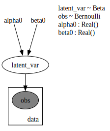
  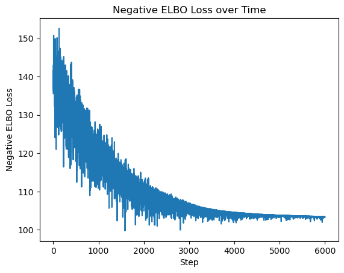
  <p><small><b>Figure 1</b>: Probabilistic model structure and loss function.</small></p>
</div>

---

## Features of Cell2Location

1. Borrow statistical strength across locations with similar cell composition
2. Account for batch variation across slides as well as variation in mRNA detection sensitivity
3. Estimate absolute cell type abundances by incorporating prior information about the analyzed tissues
4. Computationally efficient, owing to variational approximate inference and GPU acceleration
5. Integrated with the scvi-tools framework and comes with a suite of **downstream analysis** tools

---

## Sensitivity analysis of Cell2Location

### Sensitivity to the choice of hyperparameters

Cell2location is sensitive to the choice of $\alpha^y$ and $\hat{N}$, but robust to $\hat{A}$ and $\hat{B}$.

<div style="text-align:center;">
  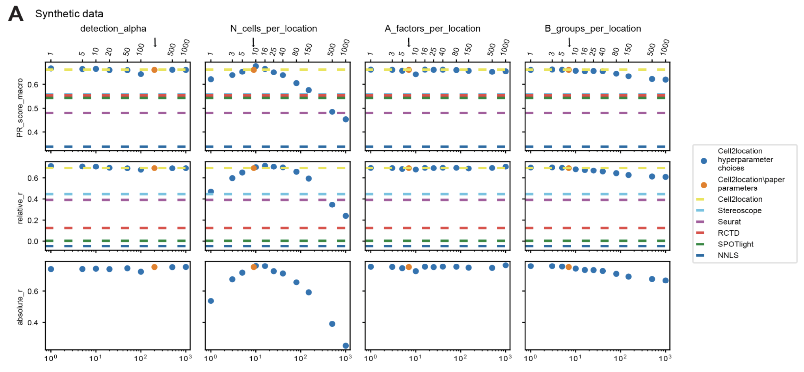
  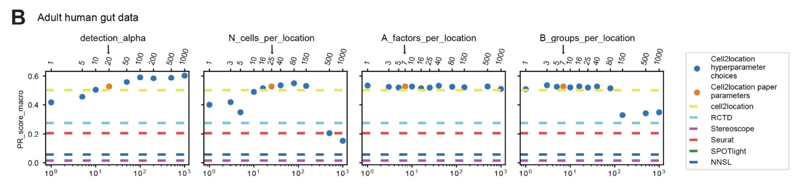
  <p><small><b>SupFigure 5</b>: Stability of cell2location cell abundance estimates with respect to model hyperparameter settings.</small></p>
</div>

### Ablation study and unaligned cell type signatures

The factorisation of cell type abundance prior $w_{sf}$ and the gene-specific technical sensitivity scaling factor $m_g$ are crucial for the performance of cell2location. Without these factors, the performance of the model is significantly reduced under various metrics and scenarios. See SupFigure 4AB.

<div style="text-align:center;">
  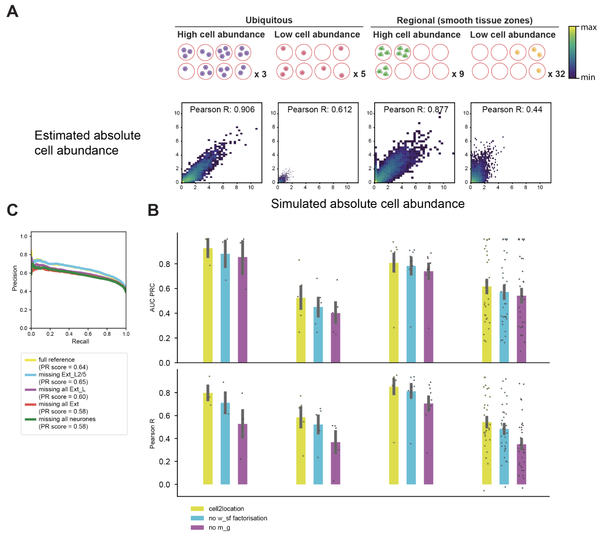
  <p><small><b>SupFigure 4</b>: Assessment of cell2location and alternative methods using simulated data.</small></p>
</div>

When removing fractions of cell types from the reference signatures, the performance of cell2location decreases slightly, as shown in SupFigure 4C. Shown are macro-average precision-recall curves across 17 retained cell types, when subsampling the remaining cell types in the reference: one Ext_L25 subtype removed, 48/49 retained; all excitatory layer Ext_L neurones removed, 42/49 retained; all excitatory Ext neurones removed, 31/49 retained; all neurones removed, 17/49 retained. 


---
---
---
---
---

## References

---
